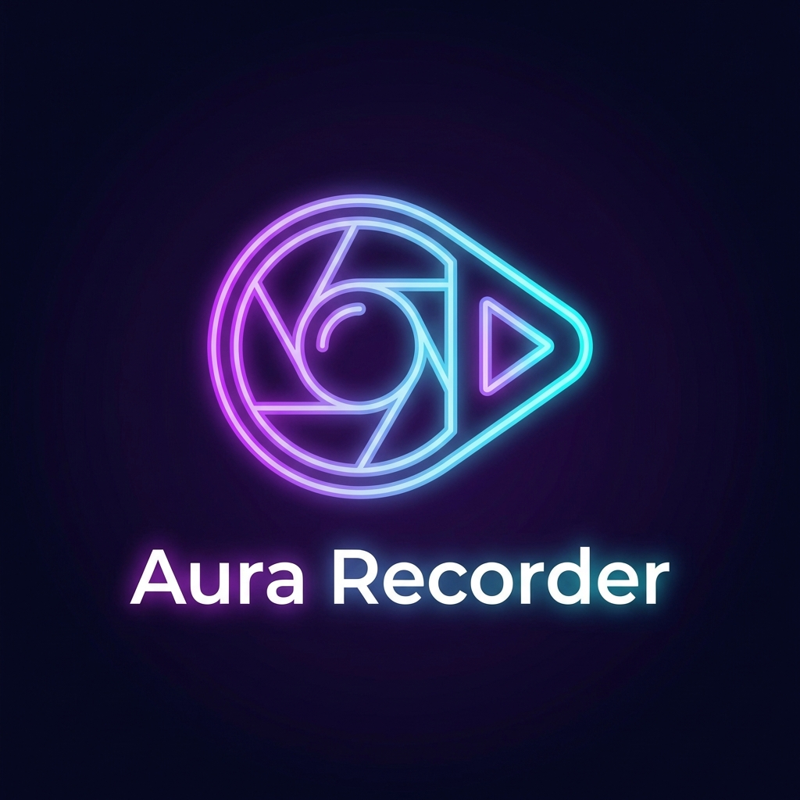

# 🌌 Aura Recorder & Converter

[](https://opensource.org/licenses/ISC)
[](https://github.com/Leonardo976/Aura-Recorder-Converter)

**Aura Recorder** es una aplicación de escritorio potente, moderna y ligera diseñada para capturar tu pantalla, aplicaciones específicas y convertir archivos multimedia con una interfaz elegante y minimalista.



## ✨ Características Principales

### 🎥 Grabación de Alta Calidad
- **Pantalla Completa o Aplicación:** Elige entre grabar todo tu escritorio o solo una ventana específica.
- **Configuración Flexible:** Soporta hasta **120 FPS** y resoluciones desde HD hasta **4K**.
- **Múltiples Formatos:** Exporta directamente a WebM (VP9), MKV o MP4.

### 🔄 Conversor Multimedia Integrado
- Convierte videos grabados o archivos externos a una amplia variedad de formatos.
- **Video:** MP4, WebM, MKV, AVI.
- **Audio:** MP3 (320kbps), WAV (Sin compresión), AAC, FLAC, OGG.
- Ajuste de calidad y FPS durante la conversión.

### 🛠️ Herramientas Avanzadas
- **Mini-Modo:** Una barra flotante compacta que no estorba mientras grabas.
- **Control de Audio:** Activa/desactiva el micrófono y el audio del sistema de forma independiente.
- **Atajos de Teclado:** Controla la grabación sin necesidad de ver la aplicación.
- **Previsualización:** Revisa tus grabaciones instantáneamente con un reproductor personalizado.

## ⌨️ Atajos de Teclado (Por defecto)

| Acción | Tecla |
| --- | --- |
| Pausar / Reanudar | `F9` |
| Detener Grabación | `F10` |
| Silenciar Micrófono | `F11` |
| Silenciar Audio PC | `F12` |

## 🚀 Instalación y Desarrollo

Aura Recorder está construido sobre **Electron** y utiliza **FFmpeg** para el procesamiento de medios.

### Requisitos
- Node.js (v16+)
- npm

### Clonar y Ejecutar
```bash
# Clonar el repositorio
git clone https://github.com/Leonardo976/Aura-Recorder-Converter.git

# Entrar al directorio
cd Aura-Recorder-Converter

# Instalar dependencias
npm install

# Iniciar la aplicación en modo desarrollo
npm start
```

### Construir Ejecutable
```bash
# Para crear una versión ejecutable/portable
npm run dist
```

## 🛠️ Tecnologías Utilizadas
- [Electron](https://www.electronjs.org/) - Framework de escritorio.
- [FFmpeg](https://ffmpeg.org/) - Motor de procesamiento multimedia.
- [Phosphor Icons](https://phosphoricons.com/) - Iconografía elegante.
- [Outfit Font](https://fonts.google.com/specimen/Outfit) - Tipografía moderna.

## 👤 Autor
Desarrollado con ❤️ por **ApoditoHot**.

---
*Aura Recorder - Captura con elegancia, convierte con potencia.*
